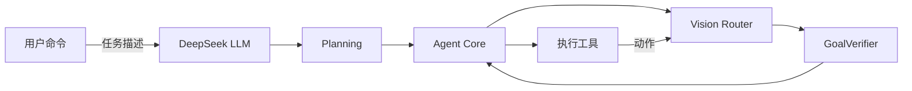

# 🤖 Computer Use Agent (Windows)

[](LICENSE)
[](https://www.python.org/)

一个面向 **Windows 桌面自动化**的多模态智能体：结合云端 LLM（规划决策）、本地视觉模型（感知）、以及本地工具执行（鼠标/键盘/PowerShell），面向复杂、非重复性桌面任务的闭环自动化。

**主脑**：DeepSeek（云端 LLM）负责决策与规划
**眼睛**：Florence-2-base（场景理解）+ Grounding DINO（目标定位）+ EasyOCR（文字识别）
**手**：Win32 API / pyautogui 鼠标键盘 + PowerShell

---

## ✨ 亮点（Features）

- ✅ **多模态感知**：Florence-2 开放词汇检测 + Grounding DINO 精确定位 + EasyOCR 文字识别
- ✅ **LLM 驱动规划**：任务开始前由 DeepSeek 自动生成「阶段状态机 + 验收规格（GoalSpec）」
- ✅ **闭环智能体**：执行动作 → 预测结果 → 验证 → 更新记忆，不再是"失忆循环"
- ✅ **独立验收**：`GoalVerifier` 基于 OCR + 工具输出独立验收，降低伪成功概率
- ✅ **状态感知与自愈**：`AgentStateMachine` 负责卡住检测、死循环检测与恢复流程
- ✅ **视觉任务路由**：`VisionRouter` 自动分流 OCR / DINO / CLIP / VLM，各司其职
- ✅ **领域技能**：`skills/` 提供文件整理（file）、游戏（game）、浏览器（browser）专属策略
- ✅ **多层记忆**：运行时工作记忆 + 抽象经验存储 + 结构化日志，便于调试与长期学习
- ✅ **工具策略**：`ToolManager` 根据任务推荐工具、记录成功率、拦截错配调用

---

## 📁 目录结构

```
vision agent/
├── computer_use_agent.py      # 入口（推荐）
├── config.py                  # 配置：从 deepseek_key.txt 读取 API Key
├── deepseek_key.txt           # [需创建] 你的 DeepSeek API Key（勿提交仓库）
├── requirements.txt           # 依赖清单
├── vismodels/                 # [需下载] 本地视觉模型
│   ├── base/                  # Florence-2-base
│   ├── dino/                  # Grounding DINO
│   └── large/                 # Florence-2-large（可选）
├── agent/
│   ├── core.py                # 主循环（规划→执行→预测→验证→验收）
│   ├── tools.py               # 全部工具（视觉/键鼠/PowerShell/OCR）
│   ├── state_manager.py       # 全局状态管理器（分层世界状态+失败计数）
│   ├── tool_manager.py        # 工具调用策略（任务→推荐工具+统计）
│   ├── task_phase.py          # 任务阶段状态机
│   ├── verifier.py            # 独立验收器（GoalSpec + 证据匹配）
│   ├── predictor.py           # 动作预测闭环
│   ├── tracker.py             # 视觉对象记忆（加速重复定位）
│   ├── logger.py              # 结构化执行日志（JSONL）
│   ├── experience.py          # 抽象经验存储（行为模式）
│   └── memory/                # 三层记忆（语义/任务/运行时+工作记忆）
├── vision/
│   ├── models.py              # 模型路径配置（自动基于项目根目录计算）
│   ├── engine.py              # 视觉引擎（F2/DINO 检测）
│   ├── router.py              # 视觉任务路由器（OCR/DETECT/CLIP/SCENE）
│   └── ocr.py                 # EasyOCR 文字识别
├── skills/                    # 领域技能（文件/游戏/浏览器）
├── knowledge/                 # 自愈知识库（运行时生成）
└── logs/                      # 结构化执行日志（运行后生成）
```

---

## 🚀 快速部署（5 步）

> 环境要求：**Windows 10/11**、**Python 3.10+**

### 1. 克隆仓库

```bash
git clone <your-repo-url>
cd "vision agent"
```

### 2. 创建虚拟环境并安装依赖

```powershell
python -m venv .venv
. .venv\Scripts\Activate.ps1
python -m pip install --upgrade pip
pip install -r requirements.txt
```

> ⚠️ **GPU 用户**：若你有 NVIDIA GPU，建议先安装 CUDA 版 PyTorch 再装其余依赖：
> ```bash
> pip install torch --index-url https://download.pytorch.org/whl/cu121
> pip install -r requirements.txt
> ```

### 3. 配置 DeepSeek API Key

在项目根目录创建文件 `deepseek_key.txt`，填入你的 Key（**不含引号**）：

```
sk-xxxxxxxxxxxxxxxxxxxxxxxxxxxxxxxx
```

> ⚠️ 请勿将 `deepseek_key.txt` 提交到仓库（已在 `.gitignore` 中忽略）。
> 没有 Key？到 [platform.deepseek.com](https://platform.deepseek.com) 注册获取。

### 4. 下载本地视觉模型

创建 `vismodels/` 目录并下载模型（HuggingFace）：

| 目录 | 模型 | HuggingFace 仓库 |
|------|------|------------------|
| `vismodels/base` | Florence-2-base | `microsoft/Florence-2-base` |
| `vismodels/dino` | Grounding DINO | `IDEA-Research/grounding-dino-base` |
| `vismodels/large` | Florence-2-large（可选） | `microsoft/Florence-2-large` |

下载示例（Python）：
```python
from huggingface_hub import snapshot_download

snapshot_download("microsoft/Florence-2-base", local_dir="vismodels/base")
snapshot_download("IDEA-Research/grounding-dino-base", local_dir="vismodels/dino")
# 可选
snapshot_download("microsoft/Florence-2-large", local_dir="vismodels/large")
```

> 💡 也可从 HuggingFace 网页手动下载文件放入对应文件夹。务必保证 `vismodels/base/`、`vismodels/dino/` **直接**包含 `config.json`、`model.safetensors` 等模型文件，不要多套一层目录。

### 5. 运行！

```bash
# 单次任务
python computer_use_agent.py "打开记事本并输入你好"

# 交互模式（可连续输入多个任务）
python computer_use_agent.py
```

首次启动会预加载视觉模型 + OCR（约 30-60 秒）。看到 `视觉模型就绪！` 即可开始。

---

## 🛠️ 配置说明（config.py）

| 配置 | 默认值 | 说明 |
|------|--------|------|
| `DEEPSEEK_API_KEY` | 从 `deepseek_key.txt` 读取 | 主脑 LLM API Key |
| `DEEPSEEK_BASE_URL` | `https://api.deepseek.com` | API 端点 |
| `DEEPSEEK_MODEL` | `deepseek-v4-flash` | 主脑 LLM 模型名 |
| `MAX_STEPS` | `200` | 单任务最大执行步数 |
| `ACTION_DELAY` | `1.5` | 动作间延迟（秒，预留，暂未启用） |

---

## 💬 使用示例

```bash
# 文件整理（走 file_skill：PowerShell 优先）
python computer_use_agent.py "帮我整理桌面的动物图片集文件夹里的文件"

# 游戏操作（走 game_skill）
python computer_use_agent.py "打开英雄联盟并进入游戏"

# 浏览器（走 browser_skill）
python computer_use_agent.py "打开百度搜索人工智能"

# 桌面操作
python computer_use_agent.py "打开设置"
```

---

## 🏗️ 架构简图



核心执行流（每步）：

```
规划（生成阶段+验收规格）
  ↓
LLM 决策（Function Calling）
  ↓
执行动作 → 预测结果 → 等待观察 → 对比验证
  ↓
状态机推进（证据驱动）
  ↓
宣告完成 → 独立验收（OCR + 工具输出）
```

---

## 🧠 架构要点

| 模块 | 职责 |
|------|------|
| `agent/core.py` | 主循环协调：规划、状态注入、工具执行、预测闭环、验收 |
| `agent/state_manager.py` | 分层世界状态（environment/ui/task）+ 失败计数 + 观察历史 |
| `agent/tool_manager.py` | 任务类型推断、工具推荐、成功率统计、错配拦截 |
| `agent/task_phase.py` | 任务阶段状态机，由观察证据驱动推进 |
| `agent/verifier.py` | 独立验收：OCR 屏幕文字 + 最近工具输出匹配 evidence |
| `vision/router.py` | 视觉任务分流：OCR/DETECT/CLASSIFY/SCENE |
| `agent/tracker.py` | 视觉对象记忆，缓存重复定位结果加速 |
| `agent/predictor.py` | 动作预测：predict→wait→observe→compare→classify |
| `agent/logger.py` | 结构化日志：每步 记忆/动作/观察/预测/验收 |
| `skills/` | 领域技能：file（文件）/ game（游戏）/ browser（浏览器） |

---

## ❓ 常见问题（FAQ）

### Q1: 提示「未找到 deepseek_key.txt」
在项目根目录创建 `deepseek_key.txt` 并填入 API Key 即可。

### Q2: 提示模型找不到 / 模型加载失败
确认 `vismodels/base`、`vismodels/dino` 内**直接**包含模型文件（`config.json`、`model.safetensors` 等），不要有多余嵌套目录。

### Q3: 类别判断（CLIP）不可用
项目优先用 CLIP 做类别判断；未安装 CLIP 时**自动回退**到 Florence-2 描述匹配，不报错。如需启用：
```bash
pip install "git+https://github.com/openai/CLIP.git"
```

### Q4: OCR 很慢
EasyOCR 默认 CPU 推理（约 2-5 秒/全屏）。优先使用 `visual_read_region()` 区域 OCR 或 `visual_find_text()` 定位文字。

### Q5: 报错「pywin32 未安装」
Win32 API 用于发送真实鼠标键盘事件；未安装时自动回退 pyautogui，功能仍可用，但建议安装：
```bash
pip install pywin32
```

### Q6: 任务未结束就停了 / 步数不够
在 `config.py` 调整 `MAX_STEPS`（默认 200）。步数越多花费越高，请按需配置。

---

## 📜 日志与调试

每次任务后，`logs/execution_YYYYMMDD_HHMMSS.jsonl` 会记录完整执行轨迹：

```
记忆先 state → 动作 → 观察 → 预测 → 记忆后 state → 验收
```

可用任意 JSON 查看器/编辑器打开分析。

---

## ⚠️ 隐私与安全

- 不要在文件里提交自己的密钥 `deepseek_key.txt` 或其他明文凭据。
- 本项目会**控制你的鼠标键盘**，请勿在无人值守时运行危险任务；运行前确保已备份重要文件。

---

## 🤝 贡献

欢迎通过 Issue 或 PR 提交改进。提交前请确保：
- 不包含敏感信息与大文件
- 尽可能添加测试
- 代码风格可使用 `flake8` 或 `black`

---

## 📄 许可证

本项目采用 MIT 许可证，详见 [LICENSE](LICENSE)。
